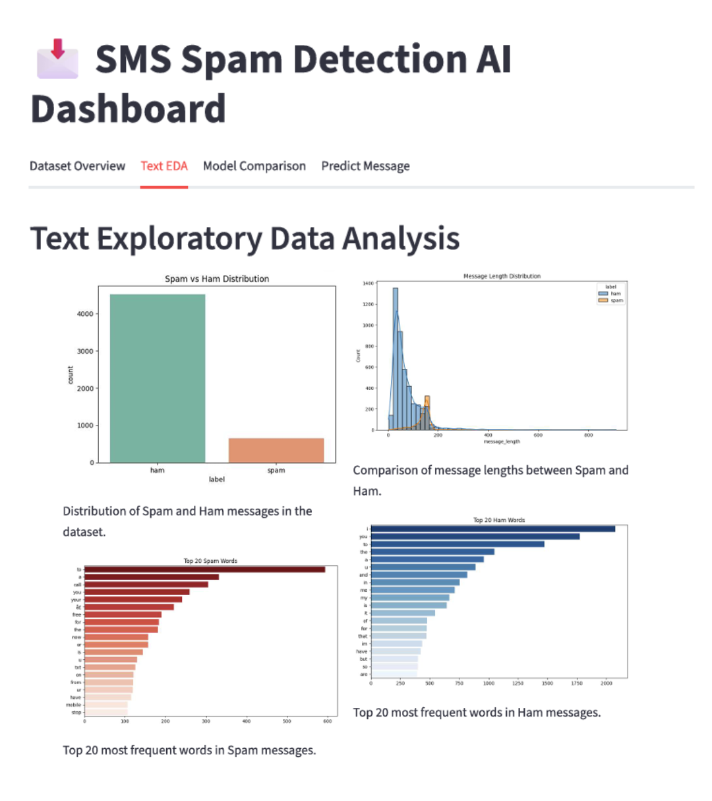
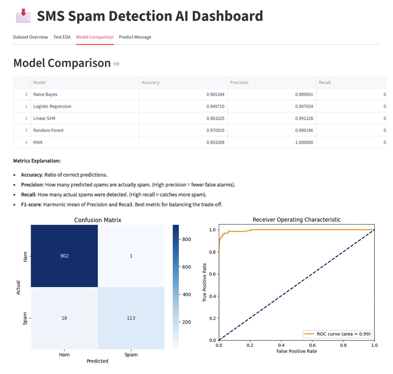
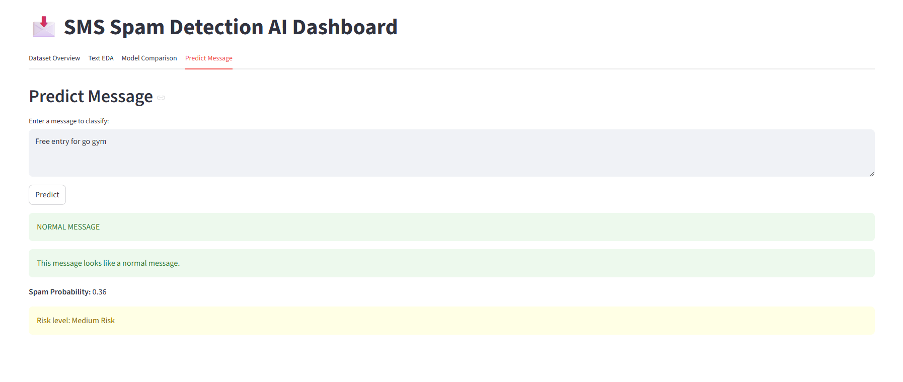

# SMS Spam Detection AI Dashboard

## Project Overview
This project is an NLP machine learning web application built to classify SMS messages as either spam or ham (normal messages).

## Business Problem
Spam detection helps protect users from junk messages, phishing attempts, and unwanted advertisements, thereby improving communication security and user experience.

## Dataset
The dataset contains two primary columns: `label` (spam or ham) and `message` (the content of the SMS).
Place the `spam.csv` dataset in the following directory before running the code:
`data/spam.csv`

## Project Workflow
1. Data loading
2. Data cleaning
3. Text preprocessing
4. TF-IDF vectorization
5. Model training
6. Model evaluation
7. Streamlit dashboard
8. Real-time prediction

## Models Used
- Multinomial Naive Bayes
- Logistic Regression
- Linear SVM
- Random Forest
- KNN

## Evaluation Metrics
- **Accuracy**: The ratio of correctly predicted observations to the total observations.
- **Precision**: The ratio of correctly predicted positive observations to the total predicted positives. Essential to minimize false positives (classifying a normal message as spam).
- **Recall**: The ratio of correctly predicted positive observations to all observations in the actual class. Important to catch as much spam as possible.
- **F1-score**: The weighted average of Precision and Recall. **F1-score is used to select the best model** because it balances precision and recall well, especially on imbalanced datasets.
- **ROC-AUC**: Represents the degree or measure of separability, showing how much the model is capable of distinguishing between classes.

## How to Run

Install dependencies:
```bash
pip install -r requirements.txt
```

Train the models and generate outputs:
```bash
python src/train_model.py
```

Run the Streamlit dashboard:
```bash
streamlit run app.py
```

## Results
- Best Model: To be updated after training.
- The models are evaluated based on their F1-score to choose the optimal pipeline.

## Dashboard Features
- Dataset overview
- Text EDA visualizations
- Model comparison
- Real-time spam prediction
## Dashboard Preview

**1. Text Exploratory Data Analysis (EDA)**


**2. Model Comparison & Metrics**


**3. Real-time Spam Prediction**


## Future Improvements
- Add deep learning model such as LSTM or GRU.
- Add Vietnamese spam detection dataset.
- Deploy on Streamlit Cloud.
- Add explainability for important words.
- Improve preprocessing with lemmatization.

## CV Bullet Points
**SMS Spam Detection AI Dashboard**
- Built an NLP-based machine learning web application to classify SMS messages as spam or ham.
- Preprocessed raw text data using text cleaning and TF-IDF vectorization.
- Trained and compared Naive Bayes, Logistic Regression, Linear SVM, Random Forest, and KNN models.
- Evaluated model performance using Accuracy, Precision, Recall, F1-score, ROC-AUC, and Confusion Matrix.
- Developed an interactive Streamlit dashboard for dataset exploration, model comparison, and real-time message classification.
- Technologies: Python, Pandas, Scikit-learn, Streamlit, Matplotlib, Seaborn, Joblib.
